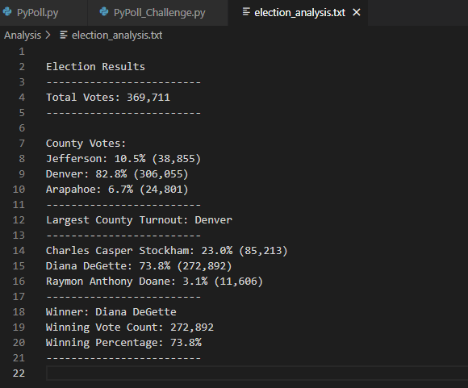

# Election Analysis

## Election Audit Overview
For the Colorado Board of Elections we performed a few tasks to complete the election audit of a recent local congressional election. Usin Python we calculated the toe total number of votes cast, extracted a complete list of candidates who received votes, calculated the total number of votes each candidate received, calculate the percentage of votes each candidate won, determined the winner of the election based on popular vote, got the voter turnout for each county, calculate the percentage of votes from each county out of the total count, and finally determined the county with the highest voter turnout.

## Resources
- Data Source: election_results.csv
- Software: Python 3.6.1, Visual Code, 1.38.1

## Election Audit Results

The analysis of the election show that:
- There were 369,711 votes cast in the election.
- The candidates were:
    - Charles Casper Stockham
    - Diana DeGette
    - Raymon Anthony Doane
- The candidate results were:
    - Charles Casper Stockham received 23% of the vote and 85,213 number of votes.
    - Diana DeGette received 73.8% of the vote and 272,892 number of votes.
    - Raymon Anthony Doane received 3.1% of the vote and 11,606 number of votes.
- The winner of the election was:
    - Diana DeGette, who received 73.8% of the vote and 272,892 number of votes.
    
Further analysis of the election show that:
- The county voter results were:
    - Jefferson county received 10.5% of the vote and 38,855 number of votes.
    - Denver county received 82.8% of the vote and 306,055 number of votes.
    - Arapahoe county received 6.7% of the vote and 24,801 number of votes.
- The county with the highest voter turnout was:
    - Denver, who received 82.8% of the vote and 306,055 number of votes.

## Election Audit Summary
This script can be used 
